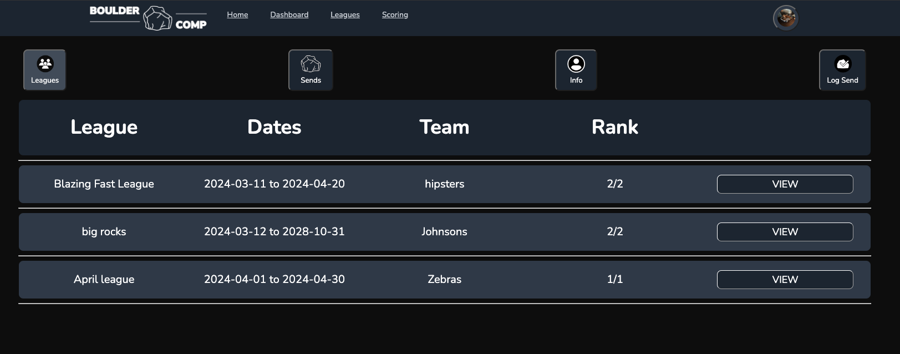
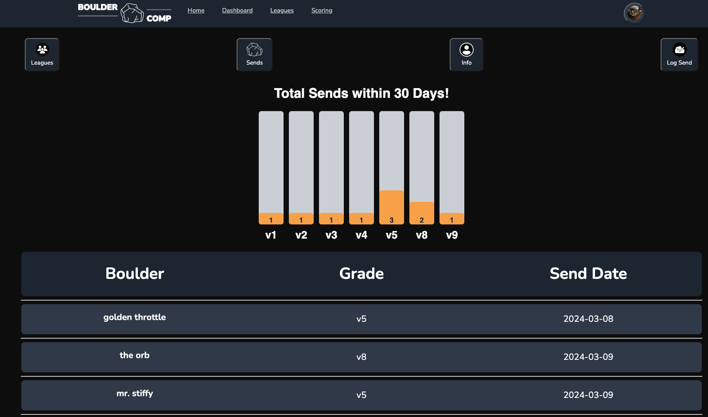
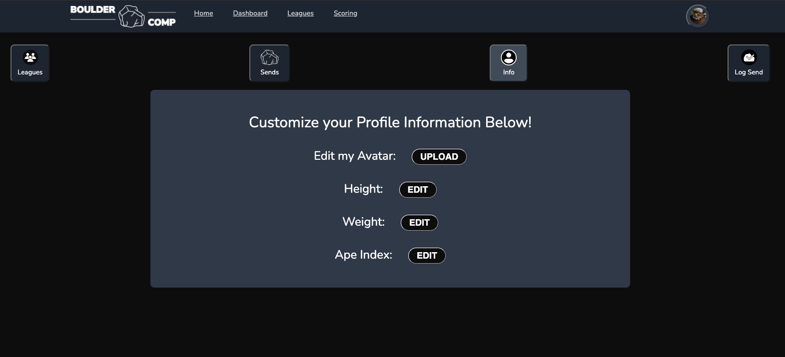
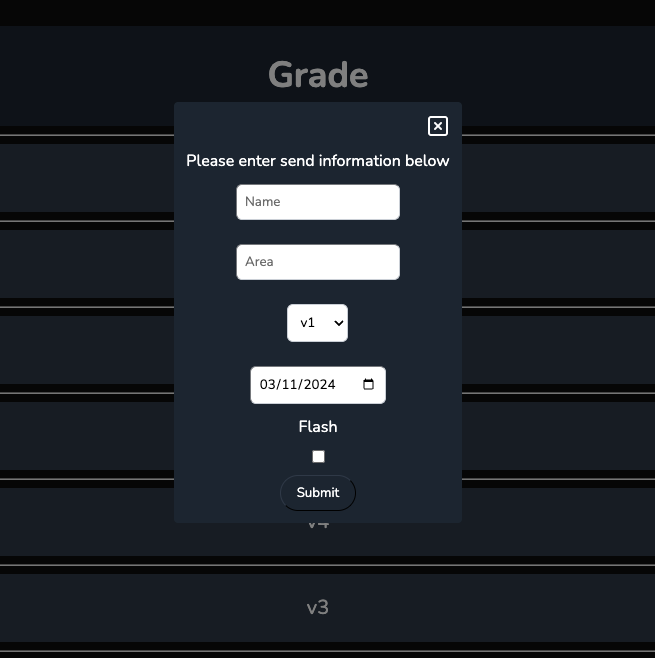
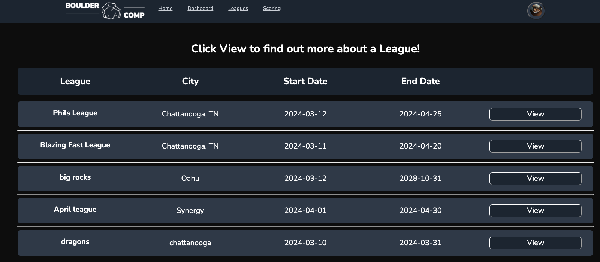
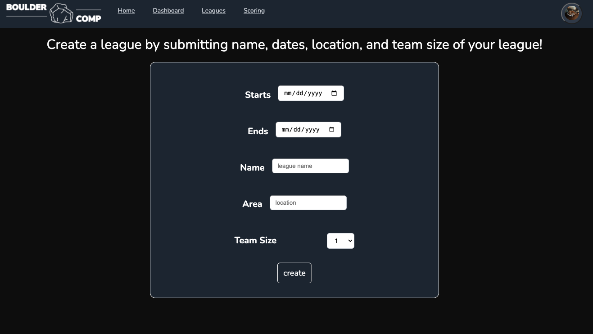
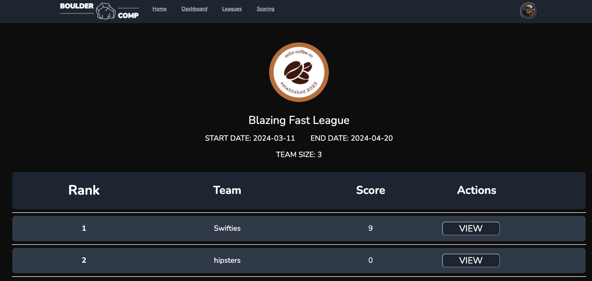
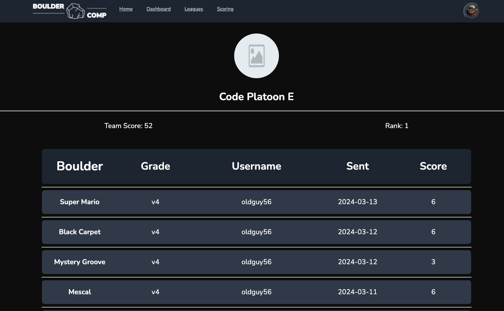

# :climbing: Boulder Comp :climbing:

Check out Boulder Comp [here](http://www.bouldercomp.com)!

---

<ins>**Welcome to Boulder Comp!**</ins> The premier platform for climbers to join leagues, form teams, and compete in bouldering challenges, both indoors and outdoors. But first, let's get acquainted with some climbing lingo:

**BOULDERING** is a form of rock climbing that is performed on a boulder or artificial rock walls without the use of ropes or harnesses. Compared to other forms of climbing, bouldering usually involves harder moves for a shorter duration.

**SEND**  a term used by rock climbers, "send" is an abbreviation of the word "ascend." It refers to successfully climbing a route or boulder from start to finish without falling, done cleanly and without any assistance.

Now, let's dive into what Boulder Comp is all about:

Whether you're a seasoned climber or just starting out, Boulder Comp offers an inclusive environment for climbers of all levels. Here's how it works:

- **Join or Create Leagues:** Users have the flexibility to either join existing leagues or create their own. There's no limit to the number of leagues you can participate in. Each league has a defined start and end date, along with a specified team size.
    
- **Log Sends:** After completing a climb, users can simply navigate to their dashboard and log a send. Users must specify the date of the send to track progress accurately. Sends that fall within the league dates will count for points in that league.
    
- **Scoring:** Points are awarded based on the difficulty of your climbs. The Users hardest completed bouldering grade determines their score, ensuring a fair and competitive playing field for participants of all skill levels. Click [here](http://3.143.247.65/rules-and-scoring) to learn more about scoring.

### Purpose
Bouldering Comp is a practical tool designed to organize bouldering competitions for the rock climbing community. The idea for this app originated from a group of friends who annually organize a competition and track all the details using Google Sheets. This app provides a more efficient way to manage leagues and access competition details. It aims to simplify the process for both organizers and participants, offering a user-friendly platform for league organization and information dissemination.

### Technology Used

**Frontend**
- Languages - JavaScript
- Frameworks and Libraries - React, React-Toastify, React Router, Tailwind, Framermotion

**Backend** 
- Languages - Python
- Framework - Django

**Database**
- PostgreSQL

**CI**
- GitHub Actions

**Other**
- Docker, AWS (EC2, S3), Git, Bash

  

          
  

## Table of Contents
- [What is bouldering?](#what-is-bouldering)
- [Using the App](#using-the-app)
    - [Pages](#pages)
        - [Dashboard](#dashboard)
        - [Leagues](#Leagues-Home)
        - [League Page](#League-Page)
        - [Team Page](#Team-Page)
        - [Scoring](#Scoring)
- [Quick Start](./backend/README.md#quickstart)
- [Contributions](./backend/README.md#contributors)

### What is bouldering?

**BOULDERING** is a form of rock climbing that is performed on a boulder or artificial rock walls without the use of ropes or harnesses. Compared to other forms of climbing, bouldering usually involves harder moves for a shorter duration.

Watch the video below to understand the basics of bouldering or click [here](https://en.wikipedia.org/wiki/Bouldering):
  

Watch the video below starting at `4:42` to learn more about the grading scale for bouldering or click [here](https://hardclimbs.info/bouldering-grades-explained/)
  

## Using the App

#### Signup
- To begin a user must first create an account to access the app's features. When a user signs up they must verify their email address to activate their account. Click [here](http://3.143.247.65/signup) to sign up.

#### Login
- On the first login the user will be prompted to submit the highest grade they have sent to date (this can be edited as it changes). This will be used for scoring purposes once the user joins a league. Click [here](http://3.143.247.65/login) to login.

#### Create or Join a League
- The purpose of the app is to compete so joining or creating a league would be the next step. This page requires a login to access. Click [here](http://3.143.247.65/leagues-home) to navigate to leagues home.

#### Log Sends
- Once the user is a member of a league they can start logging sends to earn points in any active league. The send date must occur during the league dates to be valid in any given league. Log a send by [navigating](http://3.143.247.65/dashboard) to the user dashboard.

#### View Current Standings
- The user can view their current team's standing in any active league they are a member of by navigating to their dashboard. In addition the dashboard displays all of the user's past sends and account settings.

## Pages

#### <ins>Dashboard</ins>
The dashboard provides users with a centralized view of their active leagues, a complete list of their overall sends, access to account settings, and the ability to log recent sends

  
**Leagues**
- The leagues tab displays all currently active leagues, including league name, start and end dates, the user's team name within each league, and the team's ranking out of the total number of teams. Users can easily access additional league details by clicking on the 'View' button associated with each league.
  

**Sends**
- The sends tab displays all of the sends the user has logged since they have been a registered app user. Each send includes the name of the climb, where the climb is, the difficulty, and the date sent. Once users begin to log climbs, a graph will appear showing a breakdown of what they have logged in the last thirty days.
  

**Info**
- This is where the user can upload their avatar image or change any account settings.
  

**Log Send**
- When the user clicks the `log send` tab, a modal pops up prompting the user to enter the name of the climb, area of the climb, date sent, and if they completed the climb on their first go (flash)
  

#### <ins>Leagues Home</ins>
From here the user can choose to either create a league or join a league that has not yet started

**Join**
- Users can browse leagues that have already been created and have not yet started
  

  

**Create**
- To create a league, a user must pick a league name, start and end date, and the number of members that are required per team
  

#### <ins>League Page</ins>
The league page contains all of the details for a specific league inluding a photo (optional), league name, date range, team size, and a list of all of the teams ordered by rank. Each team displays the rank, team name, and score. The user also has the option to view each team's details
  

  
#### <ins>Team Page</ins>
The team page gives a detailed view of the members activity. The details included are an image(optional), team name, rank, score, and a list of every valid send ordered by date. Each send displays the name of the boulder, grade, team member that completed the climb, date sent, and score for that send.
  

  

#### <ins>Scoring</ins>
Click [here](http://3.143.247.65/rules-and-scoring) to learn more about the scoring

[Back to Table Of Contents](#table-of-contents)

---

